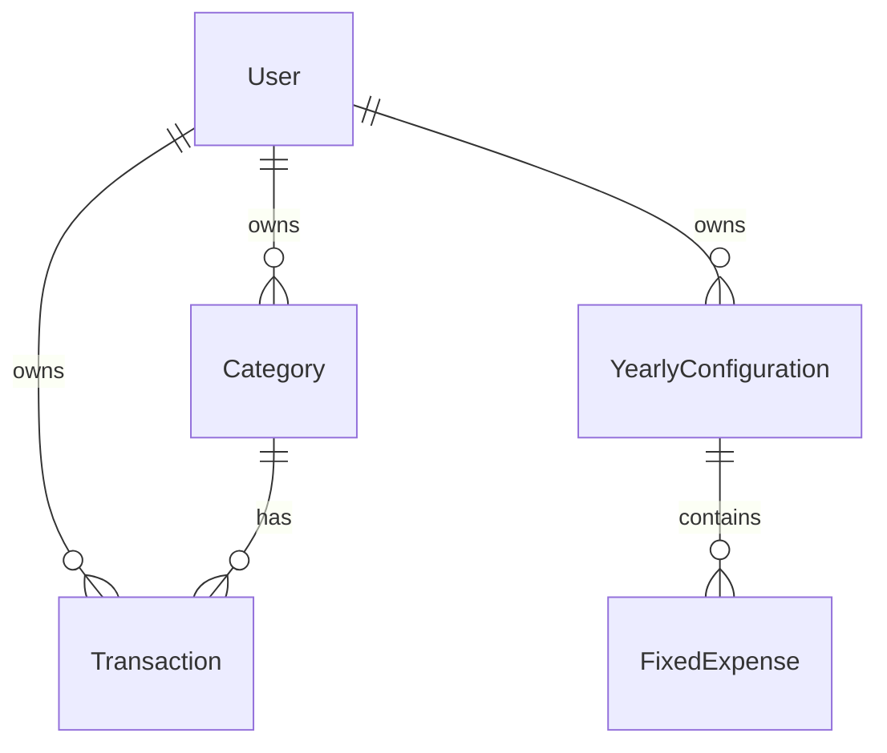

# Domain Model

This document outlines the core domain model for the AI-driven budgeting tool.

## Entity Relationships



## Entity Definitions

### User

The core entity representing a user of the system.

```typescript
interface User {
  _id: ObjectId
  email: string
  passwordHash: string
  createdAt: Date
  updatedAt: Date
}
```

### Transaction

Represents a financial transaction (income or expense) in the system.

```typescript
interface Transaction {
  _id: ObjectId
  userId: ObjectId // Reference to User
  type: "expense" | "income"
  date: Date
  categoryId: ObjectId // Reference to Category
  description: string
  amount: number
  createdAt: Date
  updatedAt: Date
}
```

### Category

Represents a classification for transactions.

```typescript
interface Category {
  _id: ObjectId
  userId: ObjectId // Reference to User
  name: string
  type: "expense" | "income"
  isDefault: boolean
  createdAt: Date
  updatedAt: Date
}
```

### YearlyConfiguration

Represents a user's yearly budget configuration.

```typescript
interface YearlyConfiguration {
  _id: ObjectId
  userId: ObjectId // Reference to User
  year: number
  monthlyIncome: number
  fixedMonthlyExpenses: FixedExpense[]
  createdAt: Date
  updatedAt: Date
}
```

### FixedExpense

Represents a recurring monthly expense in the yearly configuration.

```typescript
interface FixedExpense {
  _id: ObjectId
  name: string
  amount: number
  categoryId: ObjectId // Reference to Category
  createdAt: Date
  updatedAt: Date
}
```

## Relationships

1. **User to Transaction**: One-to-Many

   - A user can have multiple transactions
   - Each transaction belongs to exactly one user
   - Transactions are referenced by userId

2. **User to Category**: One-to-Many

   - A user can have multiple categories
   - Each category belongs to exactly one user
   - Categories are referenced by userId

3. **User to YearlyConfiguration**: One-to-Many

   - A user can have multiple yearly configurations
   - Each configuration belongs to exactly one user
   - Configurations are referenced by userId

4. **Category to Transaction**: One-to-Many

   - A category can have multiple transactions
   - Each transaction belongs to exactly one category
   - Transactions are referenced by categoryId

5. **YearlyConfiguration to FixedExpense**: One-to-Many (Embedded)
   - A yearly configuration contains multiple fixed expenses
   - Fixed expenses are embedded within the yearly configuration
   - Each fixed expense belongs to exactly one yearly configuration

## Indexes

The following indexes should be created for optimal query performance:

1. User Collection:

   - `{ email: 1 }` (unique)

2. Transaction Collection:

   - `{ userId: 1, date: 1 }`
   - `{ categoryId: 1 }`
   - `{ type: 1 }`

3. Category Collection:

   - `{ userId: 1, name: 1 }` (unique compound)
   - `{ type: 1 }`

4. YearlyConfiguration Collection:
   - `{ userId: 1, year: 1 }` (unique compound)
